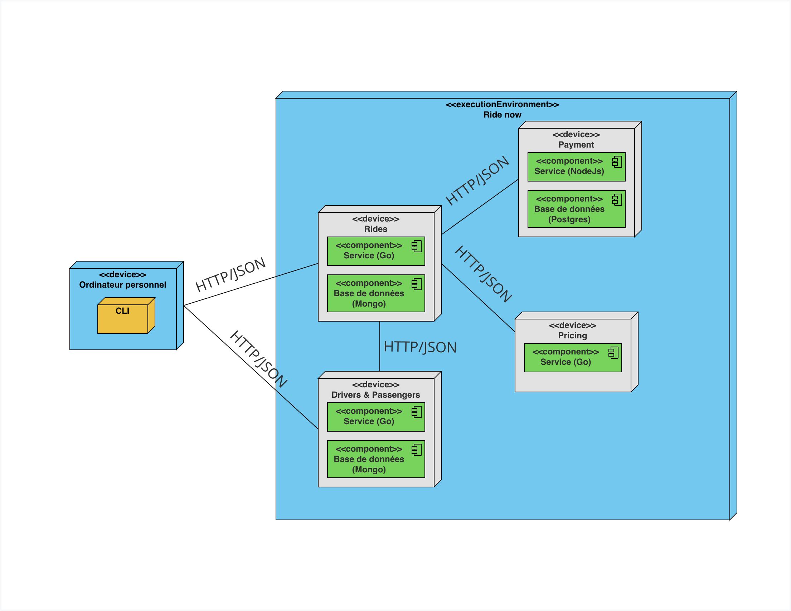

# RideNow - Microservices

Application de microservices pour la gestion de courses (RideNow).

Présentation vidéo

[](https://www.youtube.com/watch?v=P3puNrlEtm0)

## Architecture



L'application est composée de plusieurs microservices :

- **Users Service** : Gestion des chauffeurs et des passagers
- **Rides Service** : Gestion des courses
- **Pricing Service** : Calcul des prix des courses
- **Payment Service** : Gestion des paiements

Chaque service possède sa propre base de données et communique avec les autres services via HTTP.

Les services seront disponibles sur :

- **Users Service** : `http://localhost:3000`
- **Rides Service** : `http://localhost:8080`
- **Pricing Service** : `http://localhost:4000`
- **Payment Service** : `http://localhost:8004`
- **Users Database** : `localhost:27019`
- **Rides Database** : `localhost:27020`
- **Payment Database** : `localhost:5432`

## Tableau des Endpoints et Contrats d'API

### Service Users (Port 3000)

| Méthode  | Endpoint               | Description                            | Entrée                               | Sortie                                                                           |
| -------- | ---------------------- | -------------------------------------- | ------------------------------------ | -------------------------------------------------------------------------------- |
| `POST`   | `/drivers`             | Créer un chauffeur                     | `{ "name": string }`                 | `{ "id": string, "name": string, "is_available": boolean }`                      |
| `GET`    | `/drivers`             | Lister les chauffeurs                  | Query: `?available=true` (optionnel) | `[{ "id": string, "name": string, "is_available": boolean }]`                    |
| `PATCH`  | `/drivers/{id}/status` | Mettre à jour le statut d'un chauffeur | `{ "is_available": boolean }`        | `200 OK` (pas de body)                                                           |
| `POST`   | `/passengers`          | Créer un passager                      | `{ "name": string }`                 | `{ "id": string, "name": string, "created_at": string, "updated_at": string }`   |
| `GET`    | `/passengers`          | Lister tous les passagers              | -                                    | `[{ "id": string, "name": string, "created_at": string, "updated_at": string }]` |
| `GET`    | `/passengers/{id}`     | Obtenir un passager par ID             | -                                    | `{ "id": string, "name": string, "created_at": string, "updated_at": string }`   |
| `PUT`    | `/passengers/{id}`     | Mettre à jour un passager              | `{ "name": string }`                 | `{ "id": string, "name": string, "created_at": string, "updated_at": string }`   |
| `DELETE` | `/passengers/{id}`     | Supprimer un passager                  | -                                    | `204 No Content`                                                                 |

### Service Rides (Port 8080)

| Méthode | Endpoint             | Description                          | Entrée                                                                    | Sortie                                                                                                                                                                                                                                  |
| ------- | -------------------- | ------------------------------------ | ------------------------------------------------------------------------- | --------------------------------------------------------------------------------------------------------------------------------------------------------------------------------------------------------------------------------------- |
| `POST`  | `/rides`             | Créer une course                     | `{ "passengerId": string, "from_zone": string, "to_zone": string }`       | `{ "id": string, "passengerId": string, "driverId": string, "paymentId": string, "from_zone": string, "to_zone": string, "price": number, "status": "ASSIGNED", "paymentStatus": "PENDING", "createdAt": string, "updatedAt": string }` |
| `GET`   | `/rides/{id}`        | Obtenir une course par ID            | -                                                                         | `{ "id": string, "passengerId": string, "driverId": string, "paymentId": string, "from_zone": string, "to_zone": string, "price": number, "status": string, "paymentStatus": string, "createdAt": string, "updatedAt": string }`        |
| `PATCH` | `/rides/{id}/status` | Mettre à jour le statut d'une course | `{ "status": "ASSIGNED" \| "IN_PROGRESS" \| "COMPLETED" \| "CANCELLED" }` | `{ "id": string, "passengerId": string, "driverId": string, "paymentId": string, "from_zone": string, "to_zone": string, "price": number, "status": string, "paymentStatus": string, "createdAt": string, "updatedAt": string }`        |

**Note** : Lors de la création d'une course, le service Rides appelle automatiquement :

- Le service Pricing pour obtenir le prix
- Le service Users pour obtenir un chauffeur disponible
- Le service Payment pour autoriser le paiement

### Service Pricing (Port 4000)

| Méthode | Endpoint | Description                  | Entrée                          | Sortie                                              |
| ------- | -------- | ---------------------------- | ------------------------------- | --------------------------------------------------- |
| `GET`   | `/price` | Obtenir le prix d'une course | Query: `?from={zone}&to={zone}` | `{ "from": string, "to": string, "price": number }` |

**Zones disponibles** : `Centre-ville`, `Aéroport`, `Plateau`, `McGill`

### Service Payment (Port 8004)

| Méthode | Endpoint     | Description                   | Entrée                                    | Sortie                                             |
| ------- | ------------ | ----------------------------- | ----------------------------------------- | -------------------------------------------------- |
| `POST`  | `/authorize` | Autoriser un paiement         | `{ "ride_id": string, "amount": number }` | `{ "payment_id": string, "status": "AUTHORIZED" }` |
| `POST`  | `/capture`   | Capturer un paiement autorisé | `{ "payment_id": string }`                | `{ "payment_id": string, "status": "CAPTURED" }`   |

---

## Flux de base via le CLI

Cette section détaille le flux complet de création d'un chauffeur puis d'une course, en montrant toutes les interactions entre les services.

### Étape 1 : Création d'un chauffeur

**Flux détaillé :**

1. **CLI → Users Service**

   - **Requête** : `POST http://users-service:3000/drivers`
   - **Body** : `{ "name": "Jean Dupont" }`
   - **Réponse** : `{ "id": "507f1f77bcf86cd799439011", "name": "Jean Dupont", "is_available": true }`

2. **Users Service → MongoDB**
   - Insertion du chauffeur dans la collection `drivers`
   - Le champ `is_available` est automatiquement défini à `true`

**Résultat** : Un nouveau chauffeur est créé et disponible pour les courses.

---

### Étape 2 : Création d'une course

**Flux détaillé :**

1. **CLI → Users Service**

   - **Requête** : `GET http://users-service:3000/passengers`
   - **Réponse** : Liste des passagers disponibles
   - **Action** : Le CLI présente un menu pour sélectionner un passager

2. **CLI → Rides Service** (après sélection du passager et des zones)

   - **Requête** : `POST http://rides-service:8080/rides`
   - **Body** :
     ```json
     {
       "passengerId": "507f1f77bcf86cd799439012",
       "from_zone": "Centre-ville",
       "to_zone": "Aéroport"
     }
     ```

3. **Rides Service → Pricing Service**

   - **Requête** : `GET http://pricing-service:4000/price?from=Centre-ville&to=Aéroport`
   - **Réponse** : `{ "from": "Centre-ville", "to": "Aéroport", "price": 45.50 }`
   - **Action** : Le service Rides récupère le prix de la course

4. **Rides Service → Users Service**

   - **Requête** : `GET http://users-service:3000/drivers?available=true`
   - **Réponse** : `[{ "id": "507f1f77bcf86cd799439011", "name": "Jean Dupont", "is_available": true }]`
   - **Action** : Le service Rides sélectionne le premier chauffeur disponible

5. **Rides Service → Payment Service**

   - **Requête** : `POST http://payment-service:8004/authorize`
   - **Body** : `{ "ride_id": "507f1f77bcf86cd799439013", "amount": 45.50 }`
   - **Réponse** : `{ "payment_id": "P-123e4567-e89b-12d3-a456-426614174000", "status": "AUTHORIZED" }`
   - **Action** : Le paiement est autorisé (mais pas encore capturé)

6. **Rides Service → MongoDB (Rides Database)**

   - Insertion de la course dans la collection `rides` avec :
     - `status`: `"ASSIGNED"`
     - `paymentStatus`: `"PENDING"`
     - `driverId`: ID du chauffeur sélectionné
     - `price`: Prix obtenu du service Pricing

7. **Rides Service → Users Service**

   - **Requête** : `PATCH http://users-service:3000/drivers/507f1f77bcf86cd799439011/status`
   - **Body** : `{ "is_available": false }`
   - **Action** : Le chauffeur est marqué comme indisponible

8. **Rides Service → CLI**
   - **Réponse** :
     ```json
     {
       "id": "507f1f77bcf86cd799439013",
       "passengerId": "507f1f77bcf86cd799439012",
       "driverId": "507f1f77bcf86cd799439011",
       "paymentId": "P-123e4567-e89b-12d3-a456-426614174000",
       "from_zone": "Centre-ville",
       "to_zone": "Aéroport",
       "price": 45.5,
       "status": "ASSIGNED",
       "paymentStatus": "PENDING",
       "createdAt": "2024-01-15T10:30:00Z",
       "updatedAt": "2024-01-15T10:30:00Z"
     }
     ```

**Résultat** : Une course est créée avec :

- Un chauffeur assigné (maintenant indisponible)
- Un prix calculé
- Un paiement autorisé (mais pas encore capturé)

---

### Étape 3 : Complétion de la course (optionnel)

**Flux détaillé lors de la mise à jour du statut à `COMPLETED` :**

1. **CLI → Rides Service**

   - **Requête** : `PATCH http://rides-service:8080/rides/507f1f77bcf86cd799439013/status`
   - **Body** : `{ "status": "COMPLETED" }`

2. **Rides Service → MongoDB (Rides Database)**

   - Mise à jour du statut de la course à `"COMPLETED"`

3. **Rides Service → Payment Service**

   - **Requête** : `POST http://payment-service:8004/capture`
   - **Body** : `{ "payment_id": "P-123e4567-e89b-12d3-a456-426614174000" }`
   - **Réponse** : `{ "payment_id": "P-123e4567-e89b-12d3-a456-426614174000", "status": "CAPTURED" }`
   - **Action** : Le paiement est capturé

4. **Rides Service → MongoDB (Rides Database)**

   - Mise à jour du `paymentStatus` à `"CAPTURED"`

5. **Rides Service → Users Service**

   - **Requête** : `PATCH http://users-service:3000/drivers/507f1f77bcf86cd799439011/status`
   - **Body** : `{ "is_available": true }`
   - **Action** : Le chauffeur redevient disponible

6. **Rides Service → CLI**
   - **Réponse** : Course mise à jour avec `status: "COMPLETED"` et `paymentStatus: "CAPTURED"`

**Résultat** : La course est terminée, le paiement est capturé et le chauffeur redevient disponible.

## Détails des services

### Service Users

Ce service gère les chauffeurs et les passagers pour l'application RideNow.

### Service Rides

Ce service gère les courses pour l'application RideNow. Il communique avec le service Users pour obtenir les chauffeurs disponibles et mettre à jour leur statut.

#### Comportement automatique

- **Lors de la création d'une course** :

  - Un chauffeur disponible est automatiquement sélectionné
  - Le chauffeur est marqué comme indisponible (`is_available: false`)

- **Lors de la complétion d'une course** (`status: "COMPLETED"`) :
  - Le paiement est automatiquement capturé (`paymentStatus: "CAPTURED"`)
  - Le chauffeur redevient disponible (`is_available: true`)

### Service Pricing

Ce service calcule le prix d'une course en fonction des zones de départ et d'arrivée.

**Note :** Ce service est appelé automatiquement par le service Rides lors de la création d'une course.

### Service Payment

Ce service gère l'autorisation et la capture des paiements pour les courses.

## Bases de données

- **Users Database** : `ridenow_users` (MongoDB)

  - Collections : `drivers`, `passengers`
  - Port externe : `27019`

- **Rides Database** : `ridenow_rides` (MongoDB)

  - Collection : `rides`
  - Port externe : `27020`

- **Payment Database** : `ridenow_payments` (PostgreSQL)
  - Table : `payments`
  - Port externe : `5432`

### Initialisation des bases de données

Les bases de données sont automatiquement initialisées avec des données d'exemple lors du premier démarrage :

- `services/users/init-mongo.js` : Crée des chauffeurs et passagers d'exemple (MongoDB)
- `services/rides/init-mongo.js` : Crée des courses d'exemple (MongoDB)
- `services/payment/init-payment.sql` : Crée la table `payments` (PostgreSQL)

---

## Démarrage rapide

### Prérequis

- Docker et Docker Compose

### Lancement avec Docker Compose

```bash
docker compose up -d
```

### Utilisation du CLI

Le CLI permet d'interagir avec tous les services de manière interactive.

#### Installation et démarrage

Le CLI est disponible dans un conteneur Docker :

```bash
docker-compose run --build cli
```
